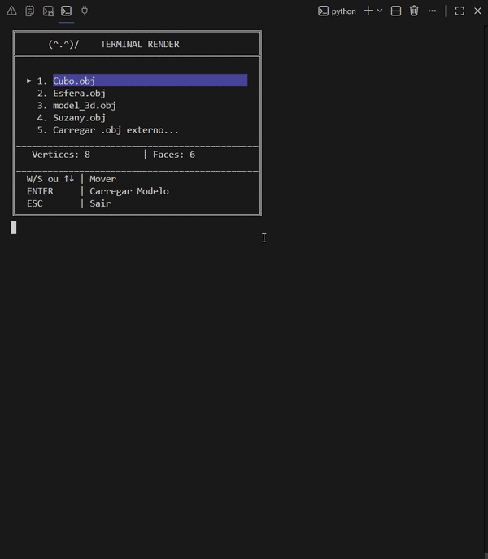
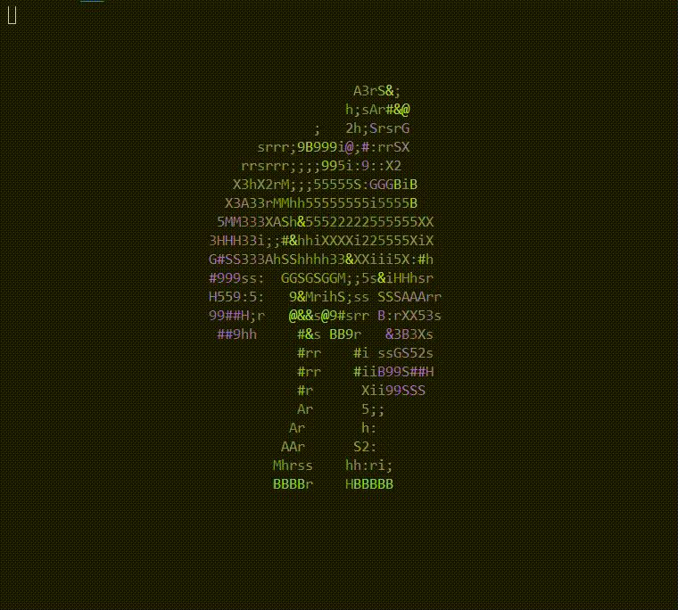
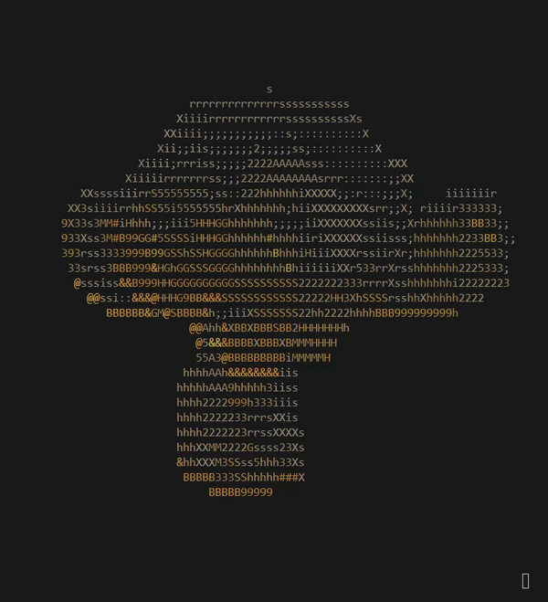
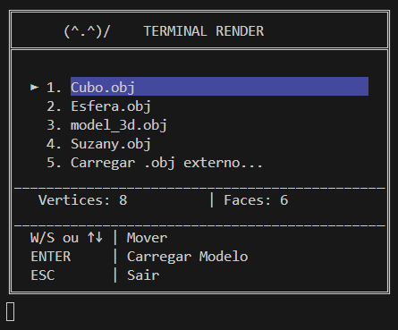

# Terminal Renderer

Um experimento de **renderização 3D diretamente no terminal**, desenvolvido em Python.

O projeto carrega modelos `.obj`, mostra informações do modelo e renderiza a malha utilizando caracteres no terminal.

## Demonstração



## Funcionalidades

- Menu interativo no terminal
- Navegação com teclado
- Carregamento de modelos `.obj`
- Contagem automática de **vértices** e **faces**
- Destaque visual da seleção com **cores ANSI**
- Sistema de **cache** para evitar releitura de arquivos
- Suporte para carregar **modelos externos**
- Integração com motor de renderização no terminal




## Controles


selecionar e mover para frente ou para trás: ` W | S` ou `↑ ↓`

Selecionar e mover para direita ou para esquerda: ` A | D` ou `→ ←  `

Subir ou se abaixar: `Q | E` ou `→ ←`

rotacionar: `J | L`

Carregar modelo: `ENTER`

Sair: `ESQ`

## Estrutura do Projeto

```bash
     terminal-renderer
     │
     ├─ main.py
     ├─ utils
     │ ├─ engine.py
     │ └─ carregar_modelo_3d.py
     │
     ├─ model_basicos
     │ └─ exemplos.obj
     │
     └─ README.md
```

## Como executar

Clone o repositório:

```bash
git clone https://github.com/seuusuario/terminal-renderer.git
```

Entre na pasta:
`cd terminal-renderer`

Execute:
`python main.py`

### Requisitos

- Python 3.x
- Terminal com suporte a `ANSI colors`

## Objetivo do Projeto

Este projeto foi criado como estudo de:

- computação gráfica
- parsing de arquivos .obj
- arquitetura de software em Python
- renderização sem engines tradicionais
  Próximos passos
- iluminação simples
- otimização de performance
- melhorias no renderizador

## Autor

Leandro Camilo.
